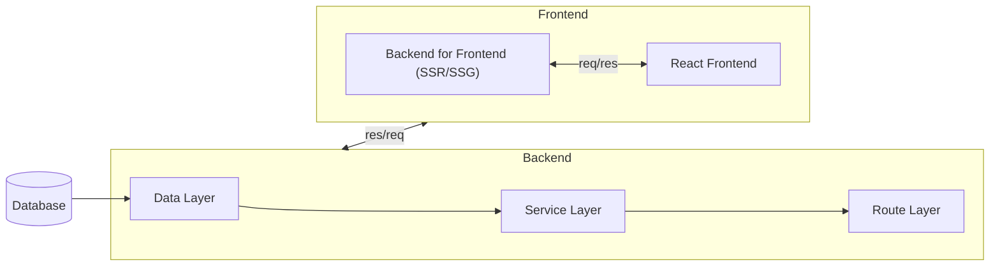

# Notes for Developing a Full-Stack Project
[Back](../README.md)

## Overview
Architecture for developing a full-stack project.

Fig 3.1 - A modern full-stack architecture, with a single backend service and a frontend with server-side rendering (SSR) and static-site generation (SSG) - `[Modern Full-Stack React Projects by Daniel Bugl]`